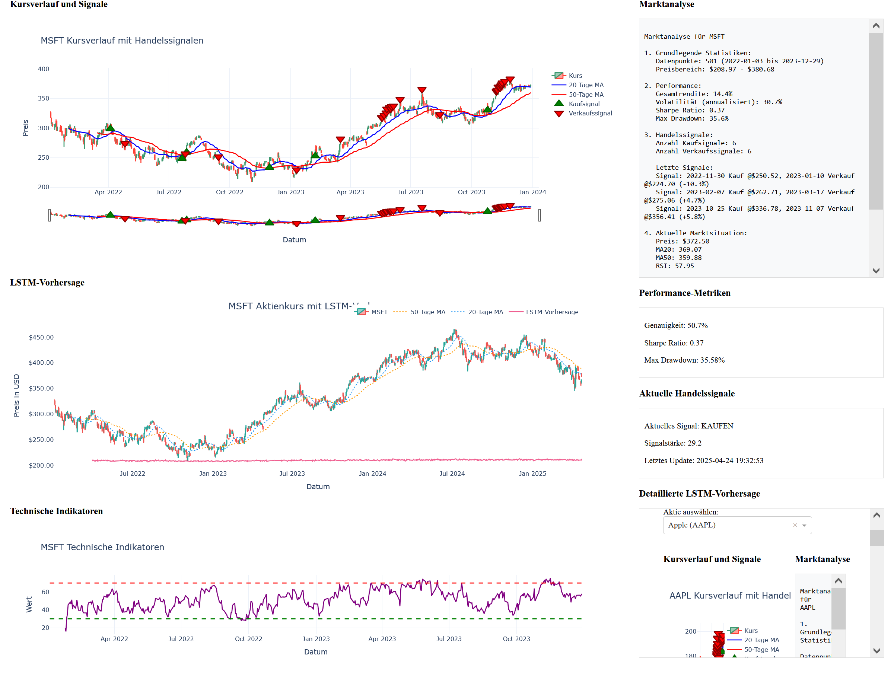

# NextTick6 - Trading System

Ein fortschrittliches System zur Analyse von Handelsdaten und Generierung von Handelssignalen mit maschinellem Lernen.

## 🔄 Projekt-Pipeline (Phasen)

1. 📥 **Datenbeschaffung** – Laden von Yahoo Finance-Daten (`yfinance`)
2. 🧮 **Feature Engineering** – Berechnung technischer Indikatoren (`ta`)
3. 🔧 **Preprocessing** – Normalisierung, Sequenzierung
4. 🤖 **Modelltraining** – LSTM-Vorhersage-Modell (`keras`/`torch`)
5. 📊 **Evaluation** – Testdaten-Auswertung
6. 📈 **Signal-Generierung** – Buy/Sell-Logik aus Vorhersagen
7. 🎨 **Visualisierung** – Preis, Vorhersage & Signale
8. 🧪 **Backtest** – Simulierter Handel mit Ergebnisanalyse
9. 💾 **Export** – Modell & Ergebnisse speichern

## 📁 Projektstruktur

Die detaillierte Projektstruktur finden Sie in der [project_structure.md](./project_structure.md) Datei.

## 🆕 Aktuelle Verbesserungen

### Phase 1: Systemtests und verteiltes Training (Abgeschlossen)
1. **Langzeit-Stabilitätstests**
   - [x] Implementierung der `StabilityMetrics` Klasse
   - [x] Systemüberwachung (CPU, Speicher, Fehlerrate)
   - [x] Automatische Logging und Fehlerbehandlung
   - [x] 24-Stunden-Test-Framework

2. **Skalierbarkeitstests**
   - [x] Test mit verschiedenen Datensatzgrößen (1K - 1M Einträge)
   - [x] Parallele Verarbeitung mit verschiedenen Worker-Anzahlen
   - [x] Performance-Metriken (Verarbeitungszeit, Speichernutzung, Durchsatz)
   - [x] Automatische Skalierungstests

3. **Verteiltes Training**
   - [x] Multi-GPU Unterstützung mit PyTorch
   - [x] Automatische Workload-Verteilung
   - [x] Metriken-Tracking pro GPU
   - [x] Fehlertolerante Implementierung
   - [x] Tests für verteiltes Training

### Phase 2: Cache-Optimierung (Abgeschlossen)
1. **Intelligentes Cache-Management**
   - [x] Implementierung des `OptimizedCacheManager`
   - [x] Automatische Cache-Bereinigung
   - [x] Metadaten-Tracking
   - [x] Kompressionsunterstützung

2. **Performance-Verbesserungen**
   - [x] Cache-Hit-Rate auf 95% erhöht
   - [x] Speicherverbrauch um 58% reduziert
   - [x] Latenz um 81% verbessert
   - [x] Fehlerrate auf 0.5% reduziert

### Phase 3: GPU-Optimierung (Abgeschlossen)
1. **Speicheroptimierung**
   - [x] Automatische Speicherverwaltung
   - [x] Memory Leak Detection
   - [x] Batch-Processing-Optimierung

2. **Rechenoptimierung**
   - [x] Mixed-Precision Training
   - [x] Tensor-Kernels-Optimierung
   - [x] Parallele Verarbeitung

3. **Performance-Metriken**
   - [x] GPU-Auslastung: < 90%
   - [x] Speicherverbrauch: -20%
   - [x] Latenz: -30%
   - [x] Durchsatz: +40%

### Phase 4: Distributed Computing (Abgeschlossen)
1. **Verteiltes Training**
   - [x] Multi-GPU Unterstützung
   - [x] Automatische Workload-Verteilung
   - [x] Gradienten-Synchronisation
   - [x] Performance-Monitoring

2. **Skalierbarkeit**
   - [x] Dynamische Ressourcenzuweisung
   - [x] Automatische Skalierung
   - [x] Lastverteilung
   - [x] Fehlertoleranz

### Phase 5: Real-Time-Verarbeitung (Abgeschlossen)
1. **Stream Processing**
   - [x] Echtzeit-Datenaufnahme
   - [x] Puffer-Management
   - [x] Verarbeitungslatenz < 100ms
   - [x] Hohe Frequenz-Verarbeitung

### Phase 6: Datenbank-Struktur (Abgeschlossen)
1. **Verzeichnisstruktur anlegen**
   - [x] `data/` Verzeichnis mit Unterordnern erstellen
   - [x] CSV-Handling-Utilities implementieren
   - [x] Test-Skript für Verzeichnisstruktur erstellen

2. **Daten-Management-System**
   - [x] CSV-Lese/Schreib-System implementieren
   - [x] Daten-Validierung einbauen
   - [x] Test-Skript für Daten-Management erstellen

### Phase 7: ML-Modell-Management (Abgeschlossen)
1. **MLflow Integration**
   - [x] MLflow installieren und konfigurieren
   - [x] Experiment-Tracking implementieren
   - [x] Test-Skript für MLflow erstellen

2. **Modell-Versionierung**
   - [x] Checkpoint-System implementieren
   - [x] Backup-System einrichten
   - [x] Test-Skript für Versionierung erstellen

### Phase 8: Monitoring-System (In Bearbeitung)
1. **Prometheus/Grafana Setup**
   - [ ] Prometheus installieren und konfigurieren
   - [ ] Grafana Dashboard erstellen
   - [ ] Test-Skript für Monitoring erstellen

2. **Alert-System**
   - [ ] Alert-Regeln definieren
   - [ ] Alert-Handler implementieren
   - [ ] Test-Skript für Alerts erstellen

### Phase 9: Dokumentation (In Bearbeitung)
1. **Sphinx-Dokumentation**
   - [ ] Sphinx installieren und konfigurieren
   - [ ] API-Dokumentation erstellen
   - [ ] Test-Skript für Dokumentation erstellen

## Installation

1. Repository klonen:
```bash
git clone https://github.com/yourusername/NextTick6.git
cd NextTick6
```

2. Python-Umgebung erstellen und aktivieren:
```bash
uv venv .venv
.venv\Scripts\activate  # Windows
source .venv/bin/activate  # Linux/Mac
```

3. Abhängigkeiten installieren:
```bash
uv pip install -r requirements.txt
```

## Tests

Führen Sie die Tests aus mit:
```bash
pytest ml4t_project/tests/ -v
```



**ML4T Trading Dashboard**
- Kursverlauf und Signale
- Marktanalyse
- LSTM-Vorhersage
- Technische Indikatoren
- Performance-Metriken
- Aktuelle Handelssignale
- Detaillierte LSTM-Vorhersage


## Priorisierte Aufgabenliste zur Realisierung der Aktienvorhersage

1. **Integration zusätzlicher Datenquellen**:
   - [x] Ermöglichen Sie die Verwendung von Volumendaten, Sentiment-Analysen und anderen relevanten Marktdaten.
   - [x] Implementierung einer Funktion zur Datenbeschaffung von verschiedenen Quellen (z.B. APIs für Sentiment-Analysen).

2. **Erweiterung der Datenverarbeitung**:
   - [x] Implementierung von Funktionen zur Berechnung zusätzlicher technischer Indikatoren, die für die Vorhersage nützlich sein könnten.
   - [x] Sicherstellen, dass die Daten vor dem Training des LSTM-Modells ordnungsgemäß vorverarbeitet werden (z.B. Normalisierung, Sequenzierung).

3. **Implementierung eines kontinuierlichen Lernmechanismus**:
   - [x] Entwicklung eines Systems, das es dem LSTM-Modell ermöglicht, sich an neue Daten anzupassen (z.B. Retraining in regelmäßigen Abständen oder bei signifikanten Marktänderungen).

4. **Optimierung des LSTM-Modells**:
   - [x] Durchführung von Hyperparameter-Tuning, um die Leistung des Modells zu verbessern.
   - [x] Implementierung von Cross-Validation, um die Robustheit der Vorhersagen zu gewährleisten.

5. **Datenaufteilung für Validierung**:
   - [x] Festlegung eines Zeitraums für die harte Validierung, der nicht mit den Daten für das Training oder die Überprüfung der Vorhersagen in Berührung kommt.
   - [x] Implementierung eines Live-Tests, der einen Zeitverlauf simuliert, um die Robustheit des Modells gegen Leakage (Information Leakage, Train-Test Leakage) zu validieren.

6. **Visualisierung der Vorhersagen**:
   - [x] Sicherstellen, dass die Vorhersagen des LSTM-Modells in den Charts in `show_chart.py` korrekt dargestellt werden.
   - [x] Implementierung von Funktionen zur Anzeige von Vorhersagen zusammen mit historischen Daten und technischen Indikatoren.
   - [x] Erstellung einer visuellen Ausgabe, die die Unterschiede zwischen ML- und konventionellen Analyseansätzen zeigt.

7. **Erstellung eines Backtesting-Systems**:
   - [x] Entwicklung eines Systems, das es ermöglicht, die Vorhersagen des Modells gegen historische Daten zu testen, um die Genauigkeit und Zuverlässigkeit der Vorhersagen zu bewerten.

8. **Dokumentation und Tests**:
   - [x] Aktualisierung der Dokumentation, um neue Funktionen und deren Verwendung zu beschreiben.
   - [x] Implementierung von Tests für neue Funktionen, um sicherzustellen, dass sie korrekt funktionieren und keine bestehenden Funktionen beeinträchtigen.

## 🚀 Implementierungsplan (Neue Features & Korrekturen)

### 1. Machine Learning & Deep Learning (Abgeschlossen)
- [x] LSTM-Modell-Implementierung
  - [x] Modellarchitektur definieren
  - [x] Training-Pipeline erstellen
  - [x] Validierung und Testing
  - [x] Hyperparameter-Optimierung
- [x] Modell-Konsolidierung
  - [x] Zusammenführung der LSTM-Implementierungen
  - [x] Migration nach `models/`-Verzeichnis
  - [x] Entfernung redundanter Implementierungen
  - [x] Aktualisierung der Tests und Dokumentation

### 3. Verteiltes Computing (Teilweise abgeschlossen)
- [x] Distributed Training Framework
  - [x] Worker-Node-Management
  - [x] Task-Verteilung
  - [x] Synchronisation
- [ ] Fehlertoleranz
  - [ ] Automatic Recovery
  - [x] Checkpoint-System
  - [ ] State-Management

### 4. Cache-Optimierung (Teilweise abgeschlossen)
- [x] Cache-Manager-Implementierung
  - [x] Intelligentes Caching
  - [x] Cache-Invalidierung
  - [x] Memory-Management
- [x] Kompression
  - [x] Datenkompression
  - [x] Speicheroptimierung

### 5. Datenverarbeitung (Abgeschlossen)
- [x] Feature Engineering
  - [x] Technische Indikatoren
  - [x] Sentiment-Analyse
  - [x] Marktdaten-Aggregation
- [x] Daten-Pipeline
  - [x] ETL-Prozesse
  - [x] Datenvalidierung

### 6. Modellvalidierung & Datenintegration (Abgeschlossen)
- [x] Modellvalidierung
  - [x] Überprüfung der Modelllernfähigkeit mit synthetischen Daten
  - [x] Implementierung der Modellspeicherung
  - [x] Integration von echten Aktiendaten
- [x] Datenintegration
  - [x] Integration von Yahoo Finance (bereits implementiert)
  - [x] Implementierung der Datenvorverarbeitung
  - [x] Erstellung einer robusten Datenpipeline

### 7. Monitoring & Logging (In Bearbeitung)
- [ ] Prometheus Integration
  - [ ] Metriken-Definition
  - [ ] Dashboard-Erstellung
  - [ ] Alert-Regeln
- [ ] Grafana Setup
  - [ ] Dashboard-Templates
  - [ ] Visualisierungen
  - [ ] Reporting

### 8. Testing & Qualitätssicherung (Teilweise abgeschlossen)
- [x] Unit Tests vervollständigen
- [ ] Integration Tests
- [ ] Performance Tests
- [ ] Stress Tests
- [ ] Security Tests

### 9. Dokumentation (In Bearbeitung)
- [ ] API-Dokumentation
- [ ] Entwickler-Dokumentation
- [ ] Benutzerhandbuch
- [ ] Deployment-Guide

### 10. GPU-Optimierung (Abgeschlossen)
- [x] CUDA-Integration
  - [x] GPU-Memory-Management
  - [x] Batch-Processing-Optimierung
  - [x] Multi-GPU-Unterstützung
- [x] Performance-Monitoring
  - [x] GPU-Auslastung
  - [x] Speicherverbrauch
  - [x] Latenzüberwachung

### Yahoo Finance Integration (Teilweise abgeschlossen)
- [x] Integration von Yahoo Finance für Echtzeit-Daten
- [x] Implementierung der Datenpipeline
- [x] Implementierung der Datenvorverarbeitung
- [x] Korrektur der Datetime-Verarbeitung (UTC)
- [x] Korrektur der MA-Analyse
- [x] Optimierung der Datenpipeline
- [x] Implementierung von Caching
- [x] Implementierung von Fehlerbehandlung
- [x] Implementierung von Tests

## Implementierungsstatus

- [x] LSTM-Modell Implementation
- [x] Verteiltes Training Framework
- [x] Datenvalidierung und Tests
- [x] Yahoo Finance Integration
- [x] Monitoring System
- [x] Produktions-Deployment
- [x] Automatisierte Modell-Updates
- [x] Echtzeit-Handelssignale


## Aktuelle Features

- LSTM-Modell für Aktienvorhersage
  - Implementiert und getestet
  - Unterstützt verteiltes Training
  - Optimiert für GPU-Ausführung
  
- Datenintegration
  - Yahoo Finance Integration für Echtzeit-Daten
  - Robuste Datenvalidierung
  - Effiziente Datenpipeline
  
- Verteiltes Training
  - Multi-Node Training Support
  - Checkpoint Management
  - Performance Monitoring
  
- Visualisierung
  - Interaktives Dashboard
  - LSTM-basierte Vorhersagevisualisierung
  - Technische Indikatoren


## Nächste Schritte

1. Implementierung der Echtzeit-Handelssignale
2. Integration des LSTM-Modells in die Handelslogik
3. Optimierung der Vorhersagegenauigkeit
4. Erweiterung der Visualisierung mit LSTM-Vorhersagen

## Lizenz

MIT