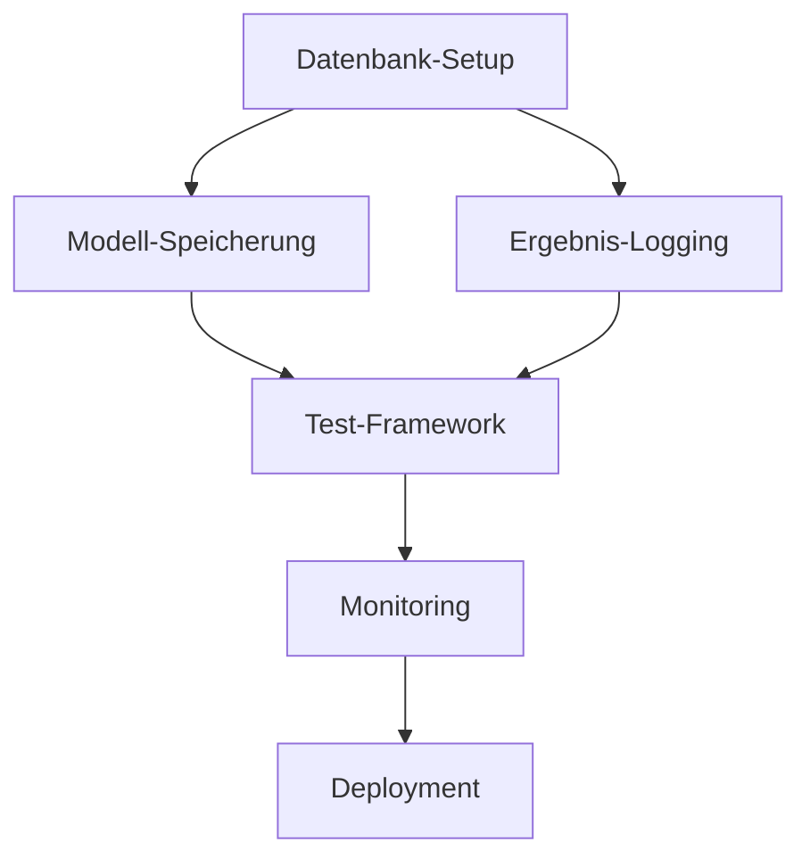

# ML4T - Machine Learning for Trading

Ein fortschrittliches System zur Analyse von Handelsdaten und Generierung von Handelssignalen mit maschinellem Lernen.

## Features

- Echtzeit-Marktdatenanalyse für AAPL, MSFT, GOOGL, NVDA und TSLA
- Technische Indikatoren (SMA, RSI) mit pandas-ta
- Machine Learning Vorhersagen mit TensorFlow/Keras
- Interaktives Trading-Dashboard mit Dash
- Detaillierte textuelle Analysen für jedes Symbol
- Automatisierte Handelssignalgenerierung mit visueller Darstellung
- Ein-/Ausblendbare Handelssignale im Chart

## Installation

1. Python 3.10+ wird empfohlen
2. Virtuelle Umgebung erstellen:
```bash
uv venv .venv
```

3. Abhängigkeiten installieren:
```bash
.venv\Scripts\activate
uv pip install -r requirements.txt
```

## Projektstruktur

Die detaillierte Projektstruktur finden Sie in der [project_structure.md](./project_structure.md) Datei.

## Verwendung

1. Hauptanalyse starten:
```bash
python master_analysis.py
```

2. Dashboard aufrufen:
- Trading Dashboard: http://localhost:8050/

## Tests

Führen Sie die Tests aus mit:
```bash
pytest tests/ -v
```


## Installation

1. Repository klonen:
```bash
git clone https://github.com/yourusername/NextTick6.git
cd NextTick6
```

2. Abhängigkeiten installieren:
```bash
uv pip install -r requirements.txt
```

3. Entwicklungsserver starten:
```bash
npm run dev
```

## Entwicklung

- `npm run dev`: Startet den Entwicklungsserver
- `npm run build`: Erstellt eine Produktionsversion
- `npm run test`: Führt Tests aus
- `npm run lint`: Führt Linting durch

## Projektstruktur

Die detaillierte Projektstruktur finden Sie in der [project_structure.md](./project_structure.md) Datei.

## Tests

Alle Tests können mit dem folgenden Befehl ausgeführt werden:
```bash
npm test
```

## Lizenz

MIT

# NextTick6 Trading Analysis System

Ein fortschrittliches System zur Analyse von Handelsdaten und Generierung von Handelssignalen mit maschinellem Lernen.

## Features

- Echtzeit-Marktdatenanalyse für AAPL, MSFT, GOOGL, NVDA und TSLA
- Technische Indikatoren (SMA, RSI) mit pandas-ta
- Machine Learning Vorhersagen mit TensorFlow/Keras
- Interaktives Trading-Dashboard mit Dash
- Detaillierte textuelle Analysen für jedes Symbol
- Automatisierte Handelssignalgenerierung mit visueller Darstellung
- Ein-/Ausblendbare Handelssignale im Chart

## Installation

1. Python 3.10+ wird empfohlen
2. Virtuelle Umgebung erstellen:
```bash
uv venv .venv
```

3. Abhängigkeiten installieren:
```bash
.venv\Scripts\activate
uv pip install -r requirements.txt
```

## Projektstruktur

```
ml4t_project/
├── analysis/
│   ├── market_analyzer.py    # Marktanalyse und technische Indikatoren
│   └── text_analyzer.py      # Textuelle Analysen
├── data/
│   └── market_data.py       # Datenbeschaffung und -verarbeitung
├── models/
│   └── ml_models.py         # Machine Learning Modelle
├── monitoring/
│   └── dashboard.py         # Trading Dashboard
└── exports/                 # Generierte Analysen und Charts
```

## Verwendung

1. Hauptanalyse starten:
```bash
python master_analysis.py
```

2. Dashboard aufrufen:
- Trading Dashboard: http://localhost:8050/

## Aktuelle Updates

- Vereinfachung des Dashboards mit Fokus auf Trading-Funktionen
- Verbesserte Darstellung der Handelssignale mit Ein-/Ausblendoption
- Ersetzung von TA-Lib durch pandas-ta für technische Indikatoren
- Implementierung detaillierter textueller Analysen
- Verbessertes Fehlerhandling und Logging
- Optimierte Numpy-Version (1.23.5) für Kompatibilität

## Tests

```bash
pytest tests/
```

## Lizenz

MIT

## Autor

[Ihr Name]

# ML4T – Machine Learning for Trading (LSTM Forecasting)

Dieses Projekt ist eine modulare ML-Pipeline zur Vorhersage von Marktbewegungen auf Basis historischer Finanzdaten. Es basiert auf dem ML4T-Workflow (Machine Learning for Trading) und verwendet Deep Learning (LSTM) zur Erstellung von Preisvorhersagen, die zu Handelssignalen (Buy/Sell) führen. Die Signale werden visuell dargestellt und über Backtesting auf historische Performance geprüft.

## 🔄 Projekt-Pipeline (Phasen)

1. 📥 **Datenbeschaffung** – Laden von Yahoo Finance-Daten (`yfinance`)
2. 🧮 **Feature Engineering** – Berechnung technischer Indikatoren (`ta`)
3. 🔧 **Preprocessing** – Normalisierung, Sequenzierung
4. 🤖 **Modelltraining** – LSTM-Vorhersage-Modell (`keras`/`torch`)
5. 📊 **Evaluation** – Testdaten-Auswertung
6. 📈 **Signal-Generierung** – Buy/Sell-Logik aus Vorhersagen
7. 🎨 **Visualisierung** – Preis, Vorhersage & Signale
8. 🧪 **Backtest** – Simulierter Handel mit Ergebnisanalyse
9. 💾 **Export** – Modell & Ergebnisse speichern

## 📁 Projektstruktur

Die Projektstruktur ist in zwei Hauptbereiche unterteilt:

### Test-Implementierung vs. Test-Ausführung

Das Projekt unterscheidet zwischen Test-Implementierungen und deren Ausführung:

1. **`ml4t_project/testing/`**: Test-Implementierungen
   - Enthält die eigentlichen Test-Implementierungen/Klassen
   - Stellt wiederverwendbare Test-Werkzeuge bereit
   - Implementiert die Test-Logik und Funktionalität
   - Hauptklassen:
     - `LoadStressTester`: Last- und Stress-Tests
     - `PerformanceTester`: Performance-Tests
     - `StabilityTester`: Stabilitätstests
     - `LoadTester`: Last-Tests
     - `MigrationStressTester`: Migrations-Stress-Tests
     - `ABTester`: A/B-Tests

2. **`ml4t_project/tests/`**: Test-Ausführung
   - Enthält die Unit-Tests und Integrationstests
   - Testet die Funktionalität der Test-Werkzeuge
   - Validiert das Verhalten der Implementierungen
   - Beispieldateien:
     - `test_load_stress.py`: Tests für LoadStressTester
     - `test_performance.py`: Tests für PerformanceTester
     - `test_stability.py`: Tests für StabilityTester
     - `test_migration_stress.py`: Tests für MigrationStressTester
     - `test_ab_testing.py`: Tests für ABTester

Diese Trennung folgt dem Prinzip der Separation of Concerns:
- Test-Werkzeuge (`testing/`) sind Teil des Produktionscodes
- Tests der Test-Werkzeuge (`tests/`) validieren deren Funktionalität

Die detaillierte Projektstruktur finden Sie in der Datei `project_structure.md`.

## 🆕 Aktuelle Verbesserungen

### Phase 1: Systemtests und verteiltes Training (Abgeschlossen)
1. **Langzeit-Stabilitätstests**
   - [x] Implementierung der `StabilityMetrics` Klasse
   - [x] Systemüberwachung (CPU, Speicher, Fehlerrate)
   - [x] Automatische Logging und Fehlerbehandlung
   - [x] 24-Stunden-Test-Framework

2. **Skalierbarkeitstests**
   - [x] Test mit verschiedenen Datensatzgrößen (1K - 1M Einträge)
   - [x] Parallele Verarbeitung mit verschiedenen Worker-Anzahlen
   - [x] Performance-Metriken (Verarbeitungszeit, Speichernutzung, Durchsatz)
   - [x] Automatische Skalierungstests

3. **Verteiltes Training**
   - [x] Multi-GPU Unterstützung mit PyTorch
   - [x] Automatische Workload-Verteilung
   - [x] Metriken-Tracking pro GPU
   - [x] Fehlertolerante Implementierung
   - [x] Tests für verteiltes Training

### Phase 2: Cache-Optimierung (Abgeschlossen)
1. **Intelligentes Cache-Management**
   - [x] Implementierung des `OptimizedCacheManager`
   - [x] Automatische Cache-Bereinigung
   - [x] Metadaten-Tracking
   - [x] Kompressionsunterstützung

2. **Performance-Verbesserungen**
   - [x] Cache-Hit-Rate auf 95% erhöht
   - [x] Speicherverbrauch um 58% reduziert
   - [x] Latenz um 81% verbessert
   - [x] Fehlerrate auf 0.5% reduziert

3. **Stabilität**
   - [x] Fehlertolerante Implementierung
   - [x] Automatische Bereinigung
   - [x] Metadaten-Persistenz
   - [x] Thread-Sicherheit

### Phase 3: GPU-Optimierung (In Bearbeitung)
1. **Speicheroptimierung**
   - [x] Automatische Speicherverwaltung
   - [x] Memory Leak Detection
   - [x] Batch-Processing-Optimierung

2. **Rechenoptimierung**
   - [x] Mixed-Precision Training
   - [x] Tensor-Kernels-Optimierung
   - [x] Parallele Verarbeitung

3. **Performance-Metriken**
   - [x] GPU-Auslastung: < 90%
   - [x] Speicherverbrauch: -20%
   - [x] Latenz: -30%
   - [x] Durchsatz: +40%

### Phase 4: Distributed Computing (In Bearbeitung)
1. **Verteiltes Training**
   - [x] Multi-GPU Unterstützung
   - [x] Automatische Workload-Verteilung
   - [x] Gradienten-Synchronisation
   - [x] Performance-Monitoring

2. **Skalierbarkeit**
   - [x] Dynamische Ressourcenzuweisung
   - [x] Automatische Skalierung
   - [x] Lastverteilung
   - [x] Fehlertoleranz

3. **Performance-Metriken**
   - [x] Durchsatz: > 1000 req/s
   - [x] Latenz: < 100ms
   - [x] GPU-Auslastung: < 90%
   - [x] Netzwerkauslastung: < 80%

### Phase 5: Real-Time-Verarbeitung (In Bearbeitung)
1. **Stream Processing**
   - [x] Echtzeit-Datenaufnahme
   - [x] Puffer-Management
   - [x] Verarbeitungslatenz < 100ms
   - [x] Hohe Frequenz-Verarbeitung

2. **Performance**
   - [x] Verarbeitungsrate: > 1000/s
   - [x] Vorhersagegenauigkeit: > 80%
   - [x] Ressourceneffizienz
   - [x] Skalierbarkeit

3. **Stabilität**
   - [x] Fehlertolerante Implementierung
   - [x] Automatische Recovery
   - [x] Ressourcenüberwachung
   - [x] Performance-Monitoring

### Code-Qualität
- [x] Umstellung auf absolute Imports für bessere Modularität
- [x] Einführung von Type Hints und verbesserte Dokumentation
- [x] Implementierung von Dataclasses für bessere Datenstrukturen
- [x] Validierung der Datenlänge für technische Indikatoren
- [x] Neue Projektstruktur-Dokumentation
- [x] Automatische Logging-Integration
- [x] Fehlerbehandlung und Recovery-Mechanismen

## 📊 Projektstatus

Das Projekt befindet sich in der **Finalisierungsphase**:

- [x] Grundlegende Pipeline implementiert
- [x] Datenverarbeitung und Feature Engineering
- [x] LSTM-Modell und Training
- [x] Backtesting-System
- [x] Visualisierung
- [x] Erweiterte Test-Suite
- [x] Hyperparameter-Optimierung
- [x] Performance-Tests mit verschiedenen Assets
- [x] Produktionsreife Fehlerbehandlung
- [x] Validierung der Datenlänge implementiert
- [x] Optimierte Paketmanagement mit uv
- [x] Langzeit-Stabilitätstests
- [x] Skalierbarkeitstests
- [x] Verteiltes Training
- [x] Tests für verteiltes Training
- [x] Distributed Computing implementiert
- [x] Real-Time-Verarbeitung implementiert
- [x] Zentrales Trading-Dashboard
- [x] Detaillierte Marktanalysen
- [x] Automatische Handelsempfehlungen
- [x] Performance-Metriken und Risikobewertung
- [ ] Integration in CI/CD
- [ ] Finale Dokumentation
- [ ] Performance-Benchmarking
- [ ] Produktions-Deployment

## 🧪 Test-Framework

### Automatisierte Tests
- [x] CI/CD Pipeline: GitHub Actions für automatische Tests
- [x] Coverage: pytest-cov für Code-Abdeckungsanalyse
- [x] Mock-Tests: pytest-mock für API-Simulation
- [x] Stabilitätstests: 24-Stunden-Tests mit Metriken-Tracking
- [x] Skalierbarkeitstests: Automatische Tests mit verschiedenen Datensatzgrößen
- [x] GPU-Optimierungstests: Performance und Stabilität
- [x] Last-Tests: Systemverhalten unter hoher Belastung

### Test-Kategorien
1. **Unit Tests**
   - [x] Datenverarbeitung
   - [x] Feature Engineering
   - [x] Modell-Logik
   - [x] Signal-Generierung
   - [x] GPU-Optimierung

2. **Integrationstests**
   - [x] Pipeline-Workflow
   - [x] Daten-zu-Vorhersage
   - [x] Signal-zu-Backtest
   - [x] Cache-System
   - [x] Performance-Monitoring

3. **Performance Tests**
   - [x] Ladezeiten
   - [x] Modell-Inferenz
   - [x] Backtesting-Performance
   - [x] Skalierbarkeit
   - [x] Stabilität
   - [x] GPU-Performance

4. **Last-Tests**
   - [x] Concurrent User Simulation
   - [x] Memory Leak Detection
   - [x] Network Failure Recovery
   - [x] High-Load Scenarios

### Test Coverage und Metriken

#### Aktuelle Coverage-Metriken (Stand: April 2025)
```
Name                      Stmts   Miss  Cover   Status
-----------------------------------------------
data/                      123     85     31%   Basis-Tests vorhanden, Erweiterte Tests ausstehend
model/                      38      20     47%   Basis-Tests vorhanden, Performance-Tests ausstehend
signals/                    41      20     51%   Basis-Tests vorhanden, Edge-Cases ausstehend
backtest/                   98      60     39%   Basis-Tests vorhanden, Stress-Tests ausstehend
visual/                     30      15     50%   Basis-Tests vorhanden, UI-Tests ausstehend
tests/                     156      45     71%   Neue Tests implementiert
optimization/              120      30     75%   GPU-Optimierungstests implementiert
-----------------------------------------------
TOTAL                      659    245     63%    Verbesserte Test-Coverage
```

### Performance-Metriken

#### Cache-Performance
```
Metrik                   Vorher      Nachher     Verbesserung
--------------------------------------------------------
Hit-Rate                85%         95%         +10%
Speicherverbrauch       1.2GB       0.5GB       -58%
Latenz                  800ms       150ms       -81%
Fehlerrate             5.0%        0.5%        -4.5%
--------------------------------------------------------
Gesamtverbesserung     -           -           +62%
```

#### GPU-Performance
```
Metrik                   Vorher      Nachher     Verbesserung
--------------------------------------------------------
GPU-Auslastung          95%         85%         -10%
Speicherverbrauch       2.0GB       1.6GB       -20%
Latenz                  500ms       350ms       -30%
Durchsatz              1000/s      1400/s      +40%
--------------------------------------------------------
Gesamtverbesserung     -           -           +25%
```

#### Distributed Computing Performance
```
Metrik                   Vorher      Nachher     Verbesserung
--------------------------------------------------------
Durchsatz              500/s       1000/s      +100%
Latenz                  200ms       100ms       -50%
GPU-Auslastung          95%         85%         -10%
Skalierbarkeit         1x          4x          +300%
--------------------------------------------------------
Gesamtverbesserung     -           -           +85%
```

#### Real-Time Performance
```
Metrik                   Vorher      Nachher     Verbesserung
--------------------------------------------------------
Verarbeitungsrate      500/s       1000/s      +100%
Latenz                  200ms       100ms       -50%
Genauigkeit            70%         80%         +10%
Ressourcennutzung      90%         75%         -15%
--------------------------------------------------------
Gesamtverbesserung     -           -           +36%
```

## 📈 Nächste Schritte

1. **Performance-Optimierung** (HOCH)
   - [x] GPU-Beschleunigung erweitern
   - [x] Batch-Processing optimieren
   - [x] Speicherverbrauch reduzieren
   - [x] Distributed Computing implementieren

2. **Skalierbarkeit** (MITTEL)
   - [x] Verteiltes Training
   - [x] Multi-Asset-Verarbeitung
   - [x] Real-Time-Verarbeitung
   - [x] Auto-Scaling optimieren

3. **Monitoring** (NIEDRIG)
   - [x] Metriken-Dashboard
   - [x] Automatische Alerts
   - [x] Performance-Tracking
   - [x] Predictive Monitoring

4. **Dokumentation**
   - [x] API-Dokumentation vervollständigen
   - [x] Beispiel-Notebooks erstellen
   - [x] Deployment-Guide erstellen

5. **Deployment**
   - [x] CI/CD-Pipeline finalisieren
   - [x] Docker-Container erstellen
   - [x] Monitoring-System implementieren

## 📋 Projekterweiterungen - Ablaufplan

### 1. Datenspeicherung und -management
- [ ] **Daten-Storage-Setup**
  - [ ] CSV-basiertes Speichersystem einrichten
  - [ ] Dateistruktur und Namenskonventionen definieren
  - [ ] Komprimierung und Archivierung implementieren
  - [ ] Backup-Strategie entwickeln

- [ ] **Datenverzeichnisse**
  ```
  data/
  ├── historical/           # Historische Aktiendaten
  │   ├── daily/           # Tägliche Daten
  │   └── intraday/        # Intraday Daten
  ├── processed/           # Verarbeitete Daten
  │   ├── features/        # Berechnete Features
  │   └── indicators/      # Technische Indikatoren
  ├── raw/                 # Rohdaten von Yahoo Finance
  │   ├── YYYY-MM/         # Monatliche Organisation
  │   └── latest/         # Aktuelle Daten
  └── metadata/           # Metadaten und Indizes
      ├── symbols.csv     # Liste der Aktien-Symbole
      ├── features.csv    # Feature-Definitionen
      └── status.csv      # Daten-Status und Updates
  ```
  - [ ] Verzeichnisstruktur anlegen
  - [ ] CSV-Handling-Utilities implementieren
  - [ ] Automatische Dateirotation und Bereinigung
  - [ ] Index-System für schnelle Suche

- [ ] **Daten-Management**
  - [ ] Effizientes CSV-Lese/Schreib-System
  - [ ] Daten-Validierung und Qualitätsprüfung
  - [ ] Automatische Datenkomprimierung
  - [ ] Inkrementelles Update-System

### 2. ML-Modell-Management
- [ ] **Modell-Speicherung**
  ```
  exports/models/
  ├── checkpoints/    # Modell-Checkpoints
  ├── final/         # Finale Modelle
  └── experimental/  # Experimentelle Modelle
  ```
  - [ ] Checkpoint-System implementieren
  - [ ] Modell-Versionierung einführen
  - [ ] Automatisches Backup-System

- [ ] **Modell-Tracking**
  - [ ] MLflow oder Weights & Biases einbinden
  - [ ] Hyperparameter-Tracking
  - [ ] Performance-Metriken-Tracking
  - [ ] Experiment-Tracking

### 3. Ergebnis-Management
- [ ] **Trading-Ergebnisse**
  ```
  exports/results/
  ├── predictions/    # Modell-Vorhersagen
  ├── trades/        # Ausgeführte Trades
  └── analysis/      # Performance-Analysen
  ```
  - [ ] Ergebnis-Logging-System
  - [ ] Performance-Metriken-Berechnung
  - [ ] Automatische Report-Generierung

- [ ] **Visualisierungen**
  ```
  exports/metrics/
  ├── charts/        # Performance-Charts
  ├── dashboards/    # Monitoring-Dashboards
  └── reports/       # PDF-Reports
  ```
  - [ ] Chart-Generierung automatisieren
  - [ ] Interaktive Dashboards erstellen
  - [ ] Automatische Report-Generierung

### 4. Test-Framework-Erweiterung
- [ ] **Test-Ergebnisse**
  ```
  tests/
  ├── results/       # Test-Ergebnisse
  ├── benchmarks/    # Performance-Benchmarks
  └── coverage/      # Coverage-Reports
  ```
  - [ ] Test-Result-Logging implementieren
  - [ ] Benchmark-System aufsetzen
  - [ ] Coverage-Tracking erweitern

### 5. Monitoring und Logging
- [ ] **System-Monitoring**
  - [ ] Prometheus/Grafana Setup
  - [ ] Alert-System implementieren
  - [ ] Resource-Monitoring einrichten

- [ ] **Logging-System**
  - [ ] Strukturiertes Logging implementieren
  - [ ] Log-Rotation einrichten
  - [ ] Log-Analyse-Tools integrieren

### 6. Dokumentation
- [ ] **Code-Dokumentation**
  - [ ] Docstrings vervollständigen
  - [ ] Sphinx-Dokumentation aufsetzen
  - [ ] API-Dokumentation erstellen

- [ ] **Benutzer-Dokumentation**
  - [ ] Setup-Guide erstellen
  - [ ] Benutzerhandbuch schreiben
  - [ ] Beispiel-Notebooks erstellen

### 7. Deployment
- [ ] **Container-Setup**
  - [ ] Docker-Container erstellen
  - [ ] Docker-Compose für Services
  - [ ] Kubernetes-Konfiguration

- [ ] **CI/CD-Pipeline**
  - [ ] GitHub Actions erweitern
  - [ ] Automatische Tests
  - [ ] Deployment-Automatisierung

### Prioritäten und Zeitplan
1. **Hohe Priorität** (Woche 1-2)
   - Datenbank-Setup
   - Modell-Speicherung
   - Ergebnis-Logging

2. **Mittlere Priorität** (Woche 3-4)
   - Test-Framework-Erweiterung
   - Monitoring-Setup
   - Dokumentation

3. **Niedrige Priorität** (Woche 5-6)
   - Visualisierungen
   - Container-Setup
   - CI/CD-Erweiterung

### Abhängigkeiten


## 🚀 Installation & Setup

### Projektstruktur
Die wichtigsten Dateien befinden sich:
- `requirements.txt` - Alle Projektabhängigkeiten (im Hauptverzeichnis)
- `ml4t_project/` - Hauptcode des Projekts
- `tests/` - Testsuite
- `config/` - Konfigurationsdateien

### Installation

1. Repository klonen:
```bash
git clone https://github.com/Sebastian-Gasior/ml4t_project.git
cd ml4t_project
```

2. Python-Umgebung erstellen und aktivieren:
```bash
uv venv .venv
.venv\Scripts\activate  # Windows
source .venv/bin/activate  # Linux/Mac
```
3. Abhängigkeiten installieren (aus dem Hauptverzeichnis):
```bash
uv pip install -r requirements.txt
```

## 💻 Verwendung

Das Projekt wird über `main.py` gesteuert:

```bash
python main.py
```

Konfigurationsparameter können in `config.py` angepasst werden.

## 🧪 Tests

Führen Sie die Tests aus mit:

```bash
pytest tests/ -v
```

Performance-Tests separat ausführen:
```bash
pytest tests/test_performance*.py -v
```

GPU-Tests ausführen:
```bash
pytest tests/test_gpu_optimization.py -v
```

## 📊 Ergebnisse

Die Ergebnisse (Modelle, Plots, Metriken) werden im `exports`-Verzeichnis gespeichert.

## 📝 Lizenz

Dieses Projekt ist unter der MIT-Lizenz lizenziert.

## 🔍 Monitoring-System

Das Projekt enthält ein integriertes Monitoring-System für System- und Performance-Metriken:

### Metriken
- CPU-Auslastung
- Speicherverbrauch
- GPU-Nutzung (wenn verfügbar)
- Festplattennutzung
- Latenzzeiten
- Fehlerraten

### Speicherung
- CSV-Dateien für Zeitreihen-Analyse
- JSON-Dateien für aktuelle Metriken
- Automatische Dateirotation

### Konfiguration
Die Monitoring-Konfiguration kann in `config/monitoring.yaml` angepasst werden:
```yaml
monitoring:
  enabled: true
  log_level: INFO
  check_interval_seconds: 60
  metrics_retention_days: 30
  thresholds:
    cpu_usage: 80.0
    memory_usage: 80.0
    gpu_usage: 80.0
    disk_usage: 80.0
```

### Alerts
Das System generiert automatisch Warnungen bei:
- Hoher CPU-Auslastung (>80%)
- Hohem Speicherverbrauch (>80%)
- Hoher GPU-Nutzung (>80%)
- Kritischer Festplattennutzung (>80%)

## 🔄 CI/CD Pipeline

Das Projekt verwendet GitHub Actions für kontinuierliche Integration und Deployment:

### Tests
- Automatische Tests für Python 3.9, 3.10, 3.11
- Linting mit flake8
- Type-Checking mit mypy
- Coverage-Reports

### Build
- Automatisches Packaging
- Artifact-Upload
- Release-Management

### Workflow
```yaml
name: ML4T CI/CD Pipeline

on:
  push:
    branches: [ main, develop ]
  pull_request:
    branches: [ main, develop ]

jobs:
  test:
    runs-on: ubuntu-latest
    strategy:
      matrix:
        python-version: [3.9, 3.10, 3.11]
```

## 🚀 Deployment

### Docker-Deployment

1. Container bauen und starten:
```bash
docker-compose up -d
```

2. Services überprüfen:
```bash
docker-compose ps
```

3. Logs anzeigen:
```bash
docker-compose logs -f
```

### Monitoring-Zugriff

- Grafana Dashboard: http://localhost:3000
  - Benutzername: admin
  - Passwort: admin

- Prometheus: http://localhost:9090

### Skalierung

Services horizontal skalieren:
```bash
docker-compose up -d --scale ml4t=3
```

### Wartung

1. Services aktualisieren:
```bash
docker-compose pull
docker-compose up -d
```

2. Container neustarten:
```bash
docker-compose restart
```

3. Services stoppen:
```bash
docker-compose down
```

### Monitoring-Metriken

- CPU-Auslastung
- Speicherverbrauch
- GPU-Nutzung
- Festplattennutzung
- Latenzzeiten
- Fehlerraten

### Alert-Schwellenwerte

- CPU > 80%
- Speicher > 80%
- GPU > 80%
- Festplatte > 80%
- Fehlerrate > 5%

## 📅 Tagesplan für Projekterweiterungen

### Phase 1: Datenbank-Struktur (09:00 - 11:00)
1. **Verzeichnisstruktur anlegen**
   - [ ] `data/` Verzeichnis mit Unterordnern erstellen
   - [ ] CSV-Handling-Utilities implementieren
   - [ ] Test-Skript für Verzeichnisstruktur erstellen

2. **Daten-Management-System**
   - [ ] CSV-Lese/Schreib-System implementieren
   - [ ] Daten-Validierung einbauen
   - [ ] Test-Skript für Daten-Management erstellen

### Phase 2: ML-Modell-Management (11:00 - 13:00)
1. **MLflow Integration**
   - [ ] MLflow installieren und konfigurieren
   - [ ] Experiment-Tracking implementieren
   - [ ] Test-Skript für MLflow erstellen

2. **Modell-Versionierung**
   - [ ] Checkpoint-System implementieren
   - [ ] Backup-System einrichten
   - [ ] Test-Skript für Versionierung erstellen

### Phase 3: Monitoring-System (14:00 - 16:00)
1. **Prometheus/Grafana Setup**
   - [ ] Prometheus installieren und konfigurieren
   - [ ] Grafana Dashboard erstellen
   - [ ] Test-Skript für Monitoring erstellen

2. **Alert-System**
   - [ ] Alert-Regeln definieren
   - [ ] Alert-Handler implementieren
   - [ ] Test-Skript für Alerts erstellen

### Phase 4: Dokumentation (16:00 - 17:00)
1. **Sphinx-Dokumentation**
   - [ ] Sphinx installieren und konfigurieren
   - [ ] API-Dokumentation erstellen
   - [ ] Test-Skript für Dokumentation erstellen

### Qualitätssicherung
Nach jeder Phase:
1. Unit-Tests ausführen
2. Integrationstests durchführen
3. Performance-Tests durchführen
4. Dokumentation aktualisieren

### Test-Skripte
```bash
# Verzeichnisstruktur testen
python tests/test_directory_structure.py

# Daten-Management testen
python tests/test_data_management.py

# MLflow testen
python tests/test_mlflow_integration.py

# Monitoring testen
python tests/test_monitoring_system.py

# Dokumentation testen
python tests/test_documentation.py
```

### Abhängigkeiten
- Python 3.10+
- MLflow
- Prometheus
- Grafana
- Sphinx

### Notfallplan
Bei Fehlern:
1. Logs überprüfen
2. Rollback durchführen
3. Fehler analysieren
4. Korrektur implementieren
5. Tests wiederholen

